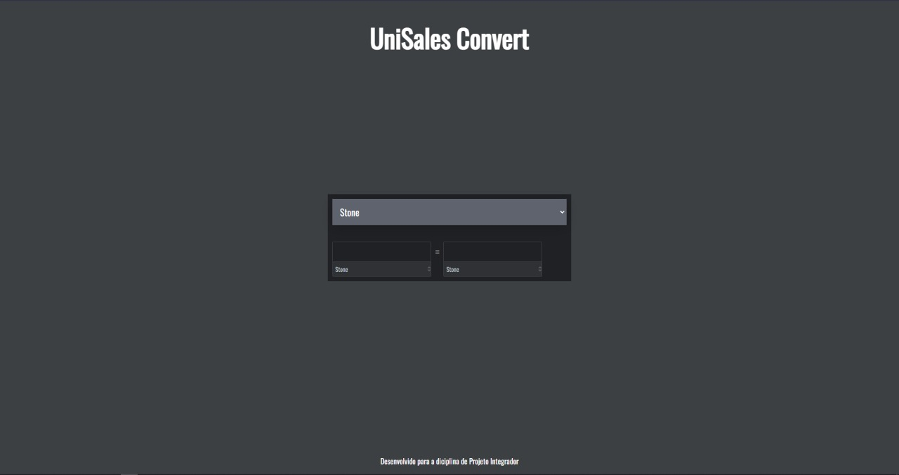

<h1 align="center">
    UniSales Convert
</h1>

  <a href="#-tecnologias">Tecnologias</a>&nbsp;&nbsp;&nbsp;|&nbsp;&nbsp;&nbsp;
  <a href="#-projeto">Projeto</a>&nbsp;&nbsp;&nbsp;|&nbsp;&nbsp;&nbsp;
  <a href="#memo-licença">Licença</a>

 

 

## 🚀 Tecnologias

Esse projeto foi desenvolvido com as seguintes tecnologias:

- [Html](https://developer.mozilla.org/pt-BR/docs/Web/HTML)
- [CSS3](https://developer.mozilla.org/pt-BR/docs/Web/CSS)
- [JavaScript](hhttps://developer.mozilla.org/pt-BR/docs/Web/JavaScript)

## 💻 Projeto

Projeto feito para a diciplina de Projeot Integrador I para a Universidade Católica Saleciano de Vitória/ES. A Ideia do projeto é fazer um conversor universal de unidades, medidas, pesos e afins. 

## 🔖 Layout

Nos links abaixo você encontra o layout do projeto web e também do mobile. Lembrando que você precisa ter uma conta no [Figma](http://figma.com/) para acessá-lo.

---

Feito com ♥ by Pizza Left :wave:
